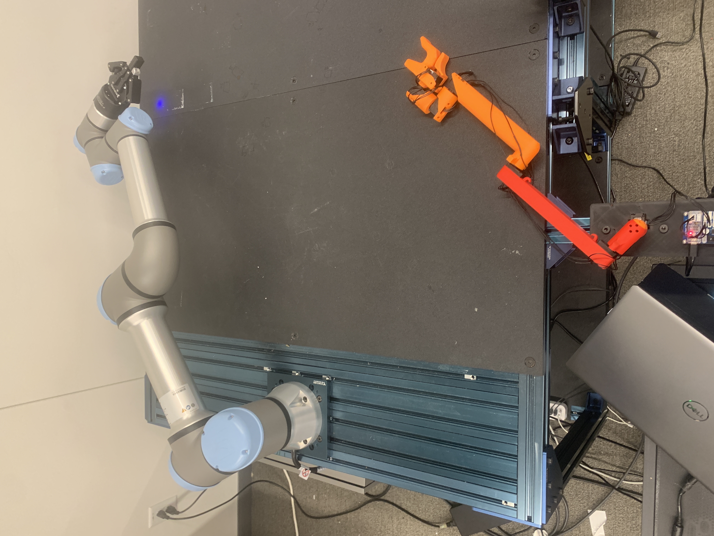
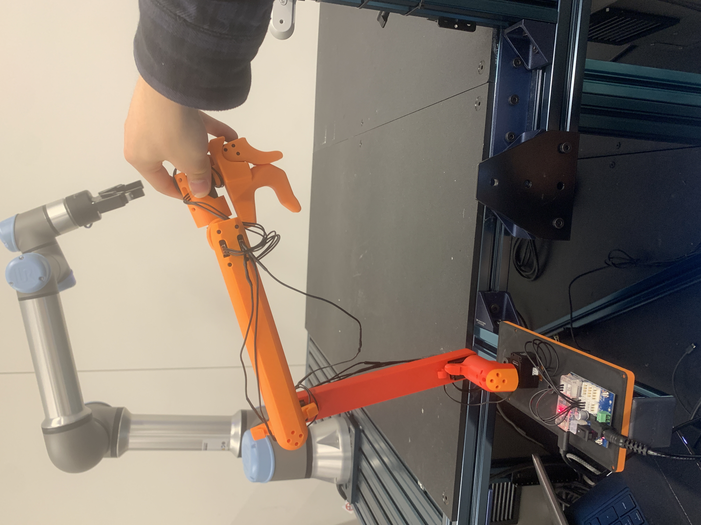

## Changes

## Set up
colcon build --symlink-install

Set the inital stance of the UR arm in "arm_teleop/initial_match_joint_pos". This will become the stance you jog the UR arm to every time you launch FACTR.

Activate robotiq gripper on pendant

## Network & pendant (one-time)

Addresses (left arm). These must stay consistent between the robot, the PC, and
`src/python_utils/python_utils/global_configs.py`:

| Role                         | Value           | Where it lives                                              |
|------------------------------|-----------------|------------------------------------------------------------|
| UR controller (robot) IP     | 192.168.1.2     | `global_configs.py` `ur_left_ip_address`; robot Network settings |
| Host PC IP                   | 192.168.1.100   | PC NIC `enp209s0f1np1`; pendant **External Control → Host IP** |
| ExternalControl custom port  | 50002           | `global_configs.py` `ur_left_real_addresses["ur_cap_port"]`; pendant **External Control → Custom port** |
| Robotiq gripper socket       | 63352           | `global_configs.py` `gripper_port` (opened by the Robotiq URCap) |

The robot is on a **direct cable** to the PC's dedicated NIC `enp209s0f1np1`
(`192.168.1.100/24`) -- an isolated link, kept off the building LAN so corporate
traffic can't add jitter to the 500 Hz RTDE loop. Robot and PC must share this
`192.168.1.0/24` subnet.

**1. Robot network (PolyScope → Hamburger menu → Settings → System → Network):**
- Select **Static Address**.
- IP address: `192.168.1.2`
- Subnet mask: `255.255.255.0`
- Gateway / DNS: `0.0.0.0` (not needed on the direct link).
- Click **Apply** and confirm the status shows "Network is connected".

**2. PC network:** the PC NIC on the robot subnet is already `192.168.1.100/24`
(`enp209s0f1np1`). Verify with `ip -brief addr` and `ping 192.168.1.2`.

**3. Install the External Control URCap (Settings → System → URCaps):**
- Click **+**, select the `externalcontrol-*.urcap` file, then **Restart** PolyScope.
- After restart, go to **Installation → External Control** and set:
  - **Host IP:** `192.168.1.100`  (this PC running FACTR)
  - **Custom port:** `50002`  (must equal `ur_cap_port` in `global_configs.py`)
  - Host name: optional.

**4. Install the Robotiq Gripper URCap** (same URCaps screen) so the gripper
socket `63352` is exposed. Set the gripper model to 2F-85 in its Installation tab.

**5. Payload & TCP (Installation → General → Payload / TCP):** set the real
payload mass, centre of gravity, and TCP. `set_up_communication()` calls
`zeroFtSensor()` at startup and the wrench is logged/used for feedback, so these
must be correct or the force readings will be biased.

## Calibration
The goal of calibration is to set the leader arm in a configuration that aligns with preset robotic arm configurations.
The leader arm must be in the pose shown in the image below with the trigger fully closed to calibrate. "arm_teleop/calibration_joint_pos" is the UR's joint angles shown in this image. This calibration only works if your UR is bolted on the table exactly like this. Other wise, you'll need to modify the field with your own calibration joint angles.
This for the left arm. 

The right arm calibration is exactly the mirror version of that image.

Note that the factr_teleop records the inital offset calibration and reuses them by reading from the json file, "offsets_{self.config['dynamixel']['leader_name']}.json". If you switch to a new leader arm but use the same configuration yaml, remember to delete that json file. Also each leader-follower set up should have a unique ['dynamixel']['leader_name'] field in their configuration.


If you're changeing the default:
Use leader_readout.py to align joint_signs in the yaml file with the UR's joint signs. The script prints out what the leader arm is giving you. For CW rotation make sure both the UR (jog it) and the leader go in the same direction.

The gripper readout (the last element) should decrease as you open the trigger. If not, make the last element of joint_signs -1.
- 1 if joint signs align between the leader and follower.
- -1 if joint signs misalign between the leader and follower.

Use leader_readout.py to record max and min position of the gripper and then calculate actuation range = |max - min|. Then put that value in the config under gripper_teleop/actuation_range. 


## Start up

Do these in order every session:

**On the pendant:**
1. Power on the controller and **Initialize robot → Start** to release the brakes.
2. **Jog the UR** to `arm_teleop/initialization/initial_match_joint_pos`
   (currently `[-1.58, -1.11, -2.84, -0.21, -0.10, 0.05]`). `set_up_communication()`
   refuses to start (raises) if the UR is more than 0.5 rad from this pose, so jog
   it close. Do **not** edit the config to match the UR — jog the UR to the config.
3. Load (or create) a program whose tree contains a single **External Control**
   node: **Program → URCaps → External Control**.
4. Press **Play (▶)**. The pendant shows "Waiting for connection on port 50002…"
   (it will say connected once FACTR attaches). Leave this program running — if it
   stops, the RTDE control channel and the servoJ watchdog drop.

**On the PC:**
5. Sanity-check the link (robot powered on + program playing):
   ```
   ping -c1 192.168.1.2
   nc -zv 192.168.1.2 30004 50002 63352   # RTDE / ExternalControl / gripper
   ```
6. Open a shell that is in the `dialout` group (needed for the Dynamixel U2D2):
   ```
   groups | grep dialout        # if missing, log out/in, or use: sg dialout -c '...'
   cd ~/FACTR_Teleop
   source ./factr_env           # ROS 2 Jazzy + .venv + workspace overlay
   ```
7. Launch FACTR (left arm):
   ```
   ros2 launch launch/factr_teleop_ur7e.py config_file:=ur7e_leader_left.yaml
   ```
8. If this leader has no saved offsets yet
   (`configs/offsets_UR7e_left_leader.json` missing), the node runs interactive
   offset calibration first — see the **Calibration** section.
9. When prompted, **move the leader arm to the initial stance** (within 0.6 rad of
   `initial_match_joint_pos`). The node logs "Initial joint position matched" and
   the follower begins mirroring.



## Running (runbook)

The exact sequence that works, with the gotchas that bite in practice.

**Two things bite if you get the order wrong:**
- You **cannot jog while a program is playing**, so jog *before* (re-)Playing External Control.
- **Launch the PC first, then press Play.** With the External Control URCap the
  *robot is the client*: pressing Play makes the robot connect out to the Host
  IP/port (`192.168.1.100:50002`), where ur_rtde (started by `ros2 launch`) is the
  *server* listening. If you press Play before launching, nothing is listening on
  the PC and the pendant errors with **connection refused** / the program stops.

1. **Pendant: jog the UR to `initial_match_joint_pos`.** Stop any running program
   (■), open **Move**, and jog to the configured pose. The node aborts (raises) if
   the UR is more than **0.5 rad** off — the error prints both the target and the
   UR's current joints, e.g.:
   ```
   follower start config differs from initial_match_joint_pos by 10.948 rad (limit 0.5).
   Jog the UR to initial_match_joint_pos = [1.64, -1.5, 1.29, -1.79, -1.56, 5.0]
   (UR is currently at [1.14, -0.34, -0.06, -2.31, -3.44, -5.61]).
   ```
   Note: the check is a plain Euclidean distance with **no ±2π wraparound** — wrist
   joints must read the same *number*, not just the same physical orientation.

2. **PC: launch first** (it opens the `50002` listener and waits up to 60 s, then
   times out with `RTDE control program is not running on controller, before
   timeout of 60 seconds`). Launch from a `dialout` shell:
   ```
   cd ~/FACTR_Teleop
   sg dialout -c 'bash -c "source ./factr_env && \
     ros2 launch launch/factr_teleop_ur7e.py config_file:=ur7e_leader_left.yaml"'
   ```
   (From a fresh login shell already in `dialout`, drop the `sg ... -c` wrapper and
   just `source ./factr_env` then `ros2 launch ...`.)

3. **Pendant: press Play (▶)** on the External Control program within that 60 s
   window. The robot connects to the listening PC → "RTDE connected (True)". Leave
   it running the whole session; if it stops (E-stop, protective stop, ■) the RTDE
   control channel and servoJ watchdog drop and you must re-jog + relaunch + Play.

4. **Leader: hold it at the start pose** when the node asks (within 0.6 rad). It
   logs "Initial joint position matched" and the follower begins mirroring.

### Gotchas / troubleshooting

- **`ModuleNotFoundError: No module named 'rtde_control'`** — ROS runs the node via
  its installed entry-point script whose shebang is the *resolved* system
  interpreter (`/usr/bin/python3.12`, because uv's `.venv/bin/python` is a symlink
  to it), which does not load the venv's site-packages. `factr_env` fixes this by
  putting the venv site-packages **and** the editable `dynamixel_sdk` source dir on
  `PYTHONPATH`. Always launch from a `factr_env` shell.

- **Hangs on "Waiting for RTDE control program…" then 60 s timeout** — External
  Control isn't playing, the program tree has a blocking node before External
  Control, or the URCap **Host IP / Custom port** don't match (`192.168.1.100` /
  `50002`). Press Play and relaunch.

- **Robot unreachable** (`ping 192.168.1.2` fails) — confirm the robot is on the
  direct subnet (`192.168.1.2/24`) and cabled to PC NIC `enp209s0f1np1`
  (`192.168.1.100/24`), not the building LAN.

- **`dialout` permission error opening the U2D2** — the shell isn't in `dialout`.
  Use a fresh login shell or the `sg dialout -c '...'` wrapper above.

- **Serial port busy** — close `viz_pose_slider.py` / `leader_readout.py` first;
  they hold the U2D2 and block the node.

- **Gripper not connecting** (`63352` closed from the PC) — first activate the
  Robotiq gripper on the pendant. If it's still closed, the cause is the
  **e-Series controller firewall**, not the gripper daemon. The Robotiq URCap
  daemon already binds `0.0.0.0:63352` (verified: the robot can reach
  `192.168.1.2:63352` from its own URScript), but the controller's iptables drops
  *external* inbound connections to `63352` while allowing the built-in UR ports
  (`29999`, `30001-30004`, ...). Fix: install the patched gripper URCap
  **`Robotiq_Grippers-1.8.13-factrfw.urcap`**, which is stock UCG-1.8.13 with one
  change — its root-run daemon launcher (`robotiq_2f_gripper_driver.sh`) adds
  `iptables -I INPUT -p tcp --dport 63352 -j ACCEPT` at startup. Legacy `.urcap`
  bundles are unsigned on PolyScope 5.x, so it repackages without re-signing.
  After install + PolyScope restart, verify from the PC:
  ```
  nc -z -w2 192.168.1.2 63352 && printf 'GET POS\n' | nc -w1 192.168.1.2 63352   # expect: POS <n>
  ```
  Diagnostics that pin this down (run a URScript probe on port `30002` while the
  robot is in **Remote Control**; have it `socket_open` to `127.0.0.1:63352`,
  `192.168.1.2:63352`, and back to the PC): loopback OPEN + own-external-IP OPEN +
  PC CLOSED == firewall. The node still degrades gracefully (arm runs without the
  follower gripper) if `63352` can't be reached.
